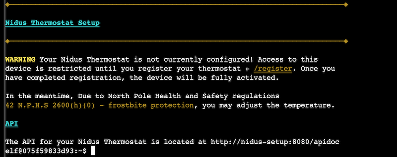

# 3) Thaw Frost Tower's Entrance

_Difficulty:_  :evergreen_tree: :evergreen_tree:

Turn up the heat to defrost the entrance to Frost Tower. Click on the Items
tab in your badge to find a link to the Wifi Dongle's CLI interface. Talk to
Greasy Gopherguts outside the tower for tips.

Greasy GopherGuts:
> Grnph. Blach! Phlegm.
> I'm Greasy Gopherguts. I need help with **parsing some Nmap output**. If you help
> me find some results, I'll give you some hints about Wi-Fi.  Click on the
> terminal next to me and read the instructions.  Maybe search for a cheat sheet
> if the hints in the terminal don't do it for ya'.  You’ll type `quizme` in the
> terminal and grep through the Nmap bigscan.gnmap file to find answers.
\
> :link: **Grep Cheat Sheet** [link](https://ryanstutorials.net/linuxtutorial/cheatsheetgrep.php)

```text
Howdy howdy!  Mind helping me with this homew- er, challenge?
Someone ran nmap -oG on a big network and produced this bigscan.gnmap file.
The quizme program has the questions and hints and, incidentally,
has NOTHING to do with an Elf University assignment. Thanks!

Answer all the questions in the quizme executable:
- What port does 34.76.1.22 have open?
- What port does 34.77.207.226 have open?
- How many hosts appear "Up" in the scan?
- How many hosts have a web port open?  (Let's just use TCP ports 80, 443, and 8080)
- How many hosts with status Up have no (detected) open TCP ports?
- What's the greatest number of TCP ports any one host has open?

Check out bigscan.gnmap and type quizme to answer each question.
```

```bash
# What port does 34.76.1.22 have open?
$ cat bigscan.gnmap | grep 34.76.1.22 | grep Ports
Host: 34.76.1.22 ()  Ports: 62078/open/tcp//iphone-sync///

# What port does 34.77.207.226 have open?
$ cat bigscan.gnmap | grep 34.77.207.226 | grep -i open
Host: 34.77.207.226 ()     Ports: 8080/open/tcp//http-proxy///

# How many hosts appear "Up" in the scan?
$ cat bigscan.gnmap | grep "Up" | cut -d' ' -f2 | sort | uniq | wc -l
26054

# How many hosts have a web port open?  (TCP ports 80, 443, and 8080)
$ cat bigscan.gnmap | grep -E "80\/open|8080\/open|443\/open" \
   | cut -d" " -f 2 | uniq | wc -l
14372
# ...alternative   grep -E "(80|443|8080)/open"

# How many hosts with status Up have no (detected) open TCP ports?
$ cat bigscan.gnmap | grep "Status: Up" | wc -l
26054 # number of hosts that are "Up"

$ cat bigscan.gnmap | grep "Up" -A1 | wc -l
51706  # open port hosts have 2nd line "Host: 34.79.255.241 () Ports: 21/open/tcp//ftp/"

# if all hosts have open ports then number should be 26054*2 = 52108
# 52108 - 51706 = 402 number of hosts that are up but no open ports

# alternative:
# echo $((`grep Up bigscan.gnmap | wc -l` - `grep Ports bigscan.gnmap | wc -l`))

# What's the greatest number of TCP ports any one host has open?
$ cat bigscan.gnmap | grep -E '(.*open.*){12}' | wc -l
5
$ cat bigscan.gnmap | grep -E '(.*open.*){13}' | wc -l
0
# alternative with awk:
# awk 'BEGIN {print}{print gsub(/open/,"") ""}' bigscan.gnmap | sort -nr | head -1
```

Greasy GopherGuts:
> Grack. Ungh. ... Oh!  You really did it?  Well, OK then. Here's what I know
> about the wifi here.  Scanning for Wi-Fi networks with iwlist will be
> location-dependent. You may need to move around the North Pole and keep
> scanning to identify a Wi-Fi network.  Wireless in Linux is supported by many
> tools, but `iwlist` and `iwconfig` are commonly used at the command line. `curl`
> can make HTTP requests at the command line!  By default, curl makes an
> HTTP GET request. You can add `--request POST` as a command line argument to make
> an HTTP POST request.  When sending HTTP POST, add `--data-binary` followed by
> the data you want to send as the POST body.
\
> :link: **POST request with data** \
   [link](https://www.educative.io/edpresso/how-to-perform-a-post-request-using-curl)

```sh
$ $ iwlist scanning
wlan0     Scan completed :
          Cell 01 - Address: 02:4A:46:68:69:21
                    Frequency:5.2 GHz (Channel 40)
                    Quality=48/70  Signal level=-62 dBm
                    Encryption key:off
                    Bit Rates:400 Mb/s
                    ESSID:"FROST-Nidus-Setup"

$ ~$ iwconfig wlan0 essid "FROST-Nidus-Setup"
iwconfig: unknown command "FROST-Nidus-Setup"
elf@075f59833d93:~$ iwconfig wlan0 essid "FROST-Nidus-Setup"
** New network connection to Nidus Thermostat detected!
Visit http://nidus-setup:8080/ to complete setup
(The setup is compatible with the 'curl' utility)
```



> Welcome to the Nidus Thermostat registration! Simply enter your serial number
> below to get started. You can find the serial number on the back of your
> Nidus Thermostat

However, querying the apidoc, `/api/cooler` is available witout registration.
Nidus Thermostat API

```text
Utilize a GET request to query information; for example, you can check the
temperatures set on your cooler with:

curl -XGET http://nidus-setup:8080/api/cooler

Utilize a POST request with a JSON payload to configuration information; for
example, you can change the temperature on your cooler using:

curl -XPOST -H 'Content-Type: application/json' \
  --data-binary '{"temperature": -40}' \
  http://nidus-setup:8080/api/cooler

WARNING: DO NOT SET THE TEMPERATURE ABOVE 0! That might melt important furniture
```

```bash
$ curl -XPOST -H 'Content-Type: application/json' \
    --data-binary '{"temperature": 0}' http://nidus-setup:8080/api/cooler
{
  "temperature": 0.96,
  "humidity": 78.11,
  "wind": 9.35,
  "windchill": -2.0,
  "WARNING": "ICE MELT DETECTED!"
}
```
