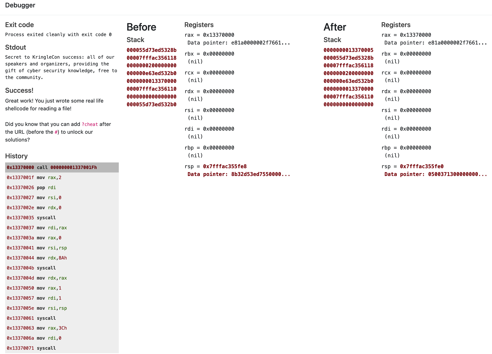
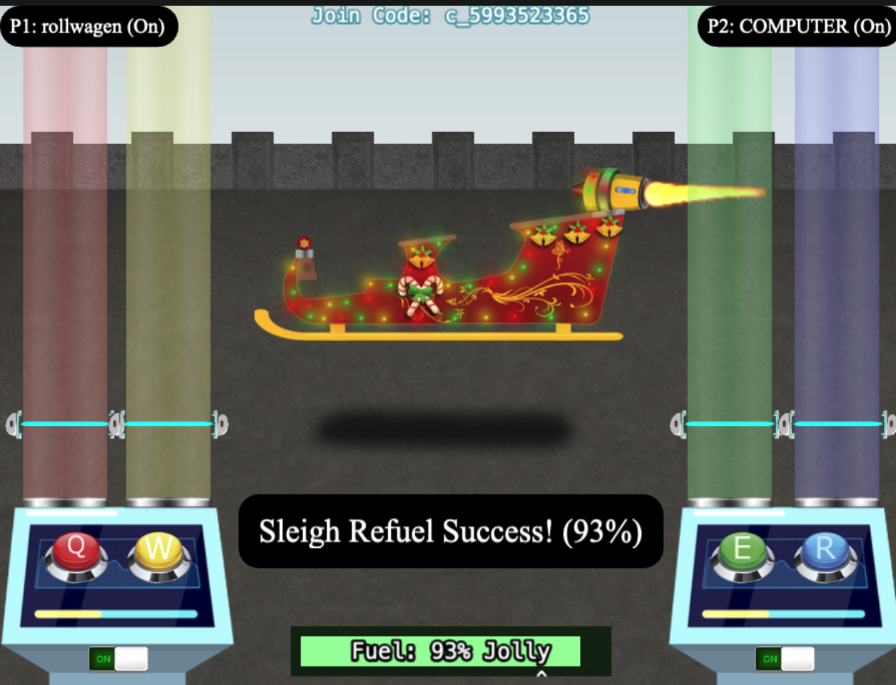

# 6) Shellcode Primer

_Difficulty:_  :evergreen_tree: :evergreen_tree: :evergreen_tree:

> Complete the [Shellcode Primer][shellcode-primer] in Jack's office. According
> to the last challenge, what is the secret to KringleCon success? "All of our
> speakers and organizers, providing the gift of `____`, free to the
> community." Talk to _Chimney Scissorsticks_ in the NetWars area for hints.

[shellcode-primer]: https://tracer.kringlecastle.com/

[Linux System Call Table for x86 64][linux-syscall-table-for-x86]
[Linux System Call Table][linux-syscall-table]

[linux-syscall-table-for-x86]: https://blog.rchapman.org/posts/Linux_System_Call_Table_for_x86_64/
[linux-syscall-table]: https://chromium.googlesource.com/chromiumos/docs/+/HEAD/constants/syscalls.md

```assembly
call get_filename_ref
db '/var/northpolesecrets.txt',0
get_filename_ref:
  pop rdi

; Call sys_open
mov rax, 2
mov rsi, 0
mov rdx, 0
syscall

; Call sys_read=0on the file handle and read it into rsp- lea rsi, [rsp]
call get_char_buf
db '                                                                     ',0
get_char_buf:
  pop rsi
mov rdi, rax
mov rax, 0
; mov rsi, rsp
mov rdx, 135
syscall

; Call sys_write to write the contents from rsp to stdout (1)
mov rax, 1
mov rdi, 1 ;stdout
;mov rsi, rsp
;lea rsi, [rsp]
mov rdx, 135
syscall

ret
```



## Challenge: Cranberry Pi Logic Munchers

Chimney Scissorsticks:

> Woo! I'm Chimney Scissorsticks, and I'm having a great time up here!  I've been
> hanging out with all these NetWars players and not worrying about what's going
> on next door.  In fact, I've really been having fun playing with this Holiday
> Hero terminal.  You can use it to generate some jamming holiday tunes that help
> power Santa’s sleigh!

```text
# cookie to set to 'true' (devtools->storage)
HOHOHO  "{\"single_player\":true}"
# additioanlly JS variable needs to be true too
single_player_mode=true
```



> You did it - rock on! We're all set now that the sleigh is fueled!  So hey, let
> me talk to you a bit about manual exploitation.  If you run into any shellcode
> primers at the North Pole, be sure to read the directions and the comments in
> the shellcode source!  Also, troubleshooting shellcode can be difficult. Use
> the debugger step-by-step feature to watch values.  Lastly, be careful not to
> overwrite any register values you need to reference later on in your shellcode.
> That's it! I know you can do it!
