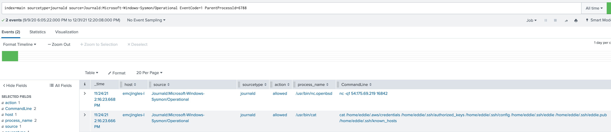

# 9 Splunk

_Difficulty:_  :evergreen_tree: :evergreen_tree: :evergreen_tree:

> Help Angel Candysalt solve the Splunk challenge in Santa's great hall.
> _Fitzy Shortstack_ is in Santa's lobby, and he knows a few things about
> Splunk. What does Santa call you when when you complete the analysis?

Fitzy Shortstack

> I was just trying to learn a bit more about YARA with this here Cranberry Pi
> terminal. I mean, I'm not saying I'm worried about attack threats from that
> other con next door, but... OK. I AM worried. I've been thinking a bit about
> how malware might bypass YARA rules. If you can help me solve the issue in
> this terminal, I’ll understand YARA so much better! Would you please check it
> out so I can learn? And, I’ll tell you what – if you help me with YARA, I’ll
> give you some tips for Splunk! I think if you make small, innocuous changes to
> the executable, you can get it to run in spite of the YARA rules.

```yara
rule yara_rule_135 {
   meta:
      description = "binaries - file Sugar_in_the_machinery"
      author = "Sparkle Redberry"
      reference = "North Pole Malware Research Lab"
      date = "1955-04-21"
      hash = "19ecaadb2159b566c39c999b0f860b4d8fc2824eb648e275f57a6dbceaf9b488"
   strings:
      $s = "candycane"
   condition:
      $s
}

rule yara_rule_1056 {
   meta:
        description = "binaries - file frosty.exe"
        author = "Sparkle Redberry"
        reference = "North Pole Malware Research Lab"
        date = "1955-04-21"
        hash = "b9b95f671e3d54318b3fd4db1ba3b813325fcef462070da163193d7acb5fcd03"
    strings:
        $s1 = {6c 6962 632e 736f 2e36}
        $hs2 = {726f 6772 616d 2121}
    condition:
        all of them
}

rule yara_rule_1732 {
   meta:
      description = "binaries - alwayz_winter.exe"
      author = "Santa"
      reference = "North Pole Malware Research Lab"
      date = "1955-04-22"
      hash = "c1e31a539898aab18f483d9e7b3c698ea45799e78bddc919a7dbebb1b40193a8"
   strings:
      $s1 = "This is critical for the execution of this program!!" fullword ascii
      $s2 = "__frame_dummy_init_array_entry" fullword ascii
      $s3 = ".note.gnu.property" fullword ascii
      $s4 = ".eh_frame_hdr" fullword ascii
      $s5 = "__FRAME_END__" fullword ascii
      $s6 = "__GNU_EH_FRAME_HDR" fullword ascii
      $s7 = "frame_dummy" fullword ascii
      $s8 = ".note.gnu.build-id" fullword ascii
      $s9 = "completed.8060" fullword ascii
      $s10 = "_IO_stdin_used" fullword ascii
      $s11 = ".note.ABI-tag" fullword ascii
      $s12 = "naughty string" fullword ascii
      $s13 = "dastardly string" fullword ascii
      $s14 = "__do_global_dtors_aux_fini_array_entry" fullword ascii
      $s15 = "__libc_start_main@@LIBC_2.2.5" fullword ascii
      $s16 = "GLIBC_2.2.5" fullword ascii
      $s17 = "its_a_holly_jolly_variable" fullword ascii
      $s18 = "__cxa_finalize" fullword ascii
      $s19 = "HolidayHackChallenge{NotReallyAFlag}" fullword ascii
      $s20 = "__libc_csu_init" fullword ascii
   condition:
      uint32(1) == 0x02464c45 and filesize < 50KB and
      10 of them
}
```

Fitzy Shortstack

> Let me tell you what I know about Splunk. Did you know Splunk recently added
> support for new data sources including Sysmon for Linux and GitHub Audit Log
> data?
> Between GitHub audit log and webhook event recording, you can monitor
> all activity in a repository, including common git commands such as `git add`,
> `git status`, and `git commit`. You can also see cloned GitHub projects.
> There's a lot of interesting stuff out there. Did you know there are
> repositories of code that are Darn Vulnerable? Sysmon provides a lot of
> valuable data, but sometimes correlation across data types is still necessary.
>
> Sysmon network events don't reveal the process parent ID for example.
> Fortunately, we can pivot with a query to investigate process creation events
> once you get a process ID. Sometimes Sysmon data collection is awkward.
> Pipelining multiple commands generates multiple Sysmon events, for example.
>
> Did you know there are multiple versions of the Netcat command that can be
> used maliciously? `nc.openbsd`, for example.

[Splunk challenge](https://hhc22.bossworkshops.io/en-GB/app/SA-hhc/santadocs)

* **Sysmon for Linux - All events**
  * `index=main sourcetype=journald source=Journald:Microsoft-Windows-Sysmon/Operational`
* **Sysmon for Linux - Process creation**
  * `index=main sourcetype=journald \
      source=Journald:Microsoft-Windows-Sysmon/Operational EventCode=1`
* **Sysmon for Linux - Network connection**
  * `index=main sourcetype=journald \
      source=Journald:Microsoft-Windows-Sysmon/Operational EventCode=3`
* **Sysmon for Linux - Using Splunk stats and sort commands \
      to find most/least common value of a field.**
  * `index=main sourcetype=journaldsource
      | source=Journald:Microsoft-Windows-Sysmon/Operational EventCode=1 \
      | user=eddie | stats count by CommandLine | sort - count`
* **GitHub Audit Log Events**
  * `index=main sourcetype=ghe_audit_log_monitoring`
* **GitHub Webhook Events (Includes detailed vulnerability alerts.)**
  * `index=main sourcetype=github_json`

---

* **Task 1**
  * _Capture the commands Eddie ran most often, starting with git.  \
         Looking only at his process launches as reported by Sysmon,  \
         record the most common git-related CommandLine that Eddie seemed to use._
  * `git status` - query from above
* **Task 2**
  * _Looking through the git commands Eddie ran, determine the remote  \
     repository that he configured as the origin for the 'partnerapi' repo. \
     The correct one!_
  * `git@github.com:elfnp3/partnerapi.git`
* **Task 3**
  * _The 'partnerapi' project that Eddie worked on uses Docker. Gather the full
       docker command line that Eddie used to start the 'partnerapi' project on
       his workstation._
  * `docker compose up`
* **Task 4**
  * _Eddie had been testing automated static application security testing
       (SAST) in GitHub. Vulnerability reports have been coming into Splunk in
       JSON format via GitHub webhooks. Search all the events in the main index
       in Splunk and use the sourcetype field to locate these reports. Determine
       the URL of the vulnerable GitHub repository that the elves cloned for
       testing and document it here. You will need to search outside of Splunk
       (try GitHub) for the original name of the repository._
  * `https://github.com/snoopysecurity/dvws-node`
* **Task 5**
  * _Santa asked Eddie to add a JavaScript library from NPM to the 'partnerapi'
      project. Determine the name of the library and record it here for our
      workshop documentation._
  * `holiday-utils-js`
* **Task 6**
  * _Another elf started gathering a baseline of the network activity that Eddie
      generated. Start with their search and capture the full process_name field
      of anything that looks suspicious._
  * `/usr/bin/nc.openbsd`
  * _query:_ `index=main sourcetype=journald
      source=Journald:Microsoft-Windows-Sysmon/Operational EventCode=3
      user=eddie dest_ip IN (54.175.69.219)`
* **Task 7**
  * _Uh oh. This documentation exercise just turned into an investigation.
      Starting with the process identified in the previous task, look for
      additional suspicious commands launched by the same parent process. One
      thing to know about these Sysmon events is that Network connection events
      don't indicate the parent process ID, but Process creation events do!
      Determine the number of files that were accessed by a related process and
      record it here._

      ```text
      ProcessID 686
      ProcessId 6791

      index=main sourcetype=journald \
        source=Journald:Microsoft-Windows-Sysmon/Operational EventCode=1 ProcessId=6791

      ParentProcessId 6788

      cat \
      /home/eddie/.aws/credentials \
      /home/eddie/.ssh/authorized_keys \
      /home/eddie/.ssh/config \
      /home/eddie/.ssh/eddie \
      /home/eddie/.ssh/eddie.pub \
      /home/eddie/.ssh/known_hosts
      ```

* **Task 8**
  * _Use Splunk and Sysmon Process creation data to identify the name of the
      Bash script that accessed sensitive files and (likely) transmitted them to
      a remote IP address._
  * `preinstall.sh`
  * _query:_ `index=main sourcetype=journald
      source=Journald:Microsoft-Windows-Sysmon/Operational EventCode=1
      ProcessId=6788`

>
> Thank you for helping Santa complete his investigation! Santa says you're a **whiz**!
>


